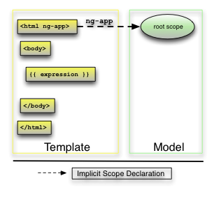
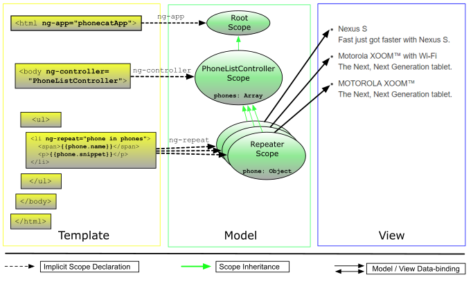

# AngularJS学习笔记

## 绑定

使用双大括号包含的表达式：

```html
<p>
    Nothing here {{'yet' + '!'}}
</p>
```

绑定告诉AngularJS需要运算其中的表达式并将结果插入DOM中，表达式在当前Angular作用域中运行

## 应用

通过ngApp指令引导AngulaJS应用

```html
<!doctype html>
<html lang="en" ng-app>
<head>
	<meta charset="utf-8">
	<title>My HTML File</title>
	<link rel="stylesheet" href="css/app.css">
	<link rel="stylesheet" href="css/bootstrap.css">
	<script src="lib/angular/angular.js"></script>
</head>
<body>
<p>Nothing here {{'yet' + '!'}}</p>
</body>
</html>	
```

用图片描述：



引导过程三个要点：

- 注入器用于创建此应用程序的依赖注入
- 注入器会创建根作用域作为应用程序作用域
- AngularJS会连接根作用域中行的DOM，从用ngApp标记的标签开始逐步处理DOM中的指令和绑定

## 控制器

除了直接使用ngApp指令创建Angular应用，还可以手动创建：

```html
<html ng-app="phonecatApp">
<head>
  ...
  <script src="bower_components/angular/angular.js"></script>
  <script src="js/controllers.js"></script>
</head>
<body ng-controller="PhoneListCtrl">

  <ul>
    <li ng-repeat="phone in phones">
      <span>{{phone.name}}</span>
      <p>{{phone.snippet}}</p>
    </li>
  </ul>

</body>
</html>
```

js代码：

```javascript
var phonecatApp = angular.module('phonecatApp', []);

phonecatApp.controller('PhoneListCtrl', function ($scope) {
  $scope.phones = [
    {'name': 'Nexus S',
     'snippet': 'Fast just got faster with Nexus S.'},
    {'name': 'Motorola XOOM? with Wi-Fi',
     'snippet': 'The Next, Next Generation tablet.'},
    {'name': 'MOTOROLA XOOM?',
     'snippet': 'The Next, Next Generation tablet.'}
  ];
});
```

过程如下：

- 首先通过angular.module('phonecatApp',  [])函数创建phonecatApp对象
- 通过phonecarApp对象的controller方法注册PhoneListCtrl对象
- 最后在html中通过ngApp和ngController分别连接到phonecatApp和PhoneListCtrl

其中需要注意两点：

- 注册PhoneListCtrl的时候，$scope代表该控制器作用域，在标有ngController标签内部所有绑定位置上可以访问到
- ngRepeat指令表示为phones数组中的每个元素创建标签<li>,其中phones数组在PhoneListCtrl中定义

图片描述：



## 过滤器

使用过滤器处理ngRepeat指令的输入：

```html
<div class="container-fluid">
    <div class="row">
      <div class="col-md-2">
        <!--Sidebar content-->
 
        Search: <input ng-model="query">
 
      </div>
      <div class="col-md-10">
        <!--Body content-->
 
        <ul class="phones">
          <li ng-repeat="phone in phones | filter:query">
            {{phone.name}}
            <p>{{phone.snippet}}</p>
          </li>
        </ul>
 
      </div>
    </div>
  </div>
```

注意两点：

- 使用ngModel指令将input标签的value和query变量进行双向绑定
- 在ngRepeat指令中使用前面绑定的query变量作为过滤器

现在输入框的内容发生变化时会引起query变换，最后导致ngRepeat指令重新执行

## 排序

ngRepeat指令除了接受过滤器以外还支持排序：

```html
Search: <input ng-model="query">
  Sort by:
  <select ng-model="orderProp">
    <option value="name">Alphabetical</option>
    <option value="age">Newest</option>
  </select>
 
  <ul class="phones">
    <li ng-repeat="phone in phones | filter:query | orderBy:orderProp">
      <span>{{phone.name}}</span>
      <p>{{phone.snippet}}</p>
    </li>
  </ul>
```

控制器代码：

```javascript
var phonecatApp = angular.module('phonecatApp', []);
 
phonecatApp.controller('PhoneListCtrl', function ($scope) {
  $scope.phones = [
    {'name': 'Nexus S',
     'snippet': 'Fast just got faster with Nexus S.',
     'age': 1},
    {'name': 'Motorola XOOM? with Wi-Fi',
     'snippet': 'The Next, Next Generation tablet.',
     'age': 2},
    {'name': 'MOTOROLA XOOM?',
     'snippet': 'The Next, Next Generation tablet.',
     'age': 3}
  ];
 
  $scope.orderProp = 'age';
});	
```

要点：

- 添加了<select>元素，并使用ngModel指令将value和orderProp变量双向绑定
- ngRepeat指令中多加了orderBy过滤器进行排序，作用是对phones数组按照orderProp进行排序
- 在声明PhoneListCtrl的时候给orderProp属性初始值设置为age

## XHR服务

$http是Angular内置的XHR服务,在需要的时候通过依赖注入提供:

```javascript
var phonecatApp = angular.module('phonecatApp', []);
 
phonecatApp.controller('PhoneListCtrl', function ($scope, $http) {
  $http.get('phones/phones.json').success(function(data) {
    $scope.phones = data;
  });
 
  $scope.orderProp = 'age';
});
```

要点:

- 其中$http是由Angular内置的XHR服务,由依赖注入提供

## 图片SRC

在Angular应用中使用标签,如果src是通过绑定方式给的:

```html

```

那么在Angular计算绑定表达式之前,标签会将绑定表达式视作url地址发起请求,比如像http://localhost:8000/app/{{phone.imageUrl}}发出请求,这当然是不正确的.

可以通过ngSrc指令解决这个问题

```html

```

## 依赖注入

依赖注入是Angular的核心.在启动应用程序的时候,Angular创建了一个注入器,用于寻找并注入你所需要的服务..

### Provider

$provide服务负责告诉Angular如何新建依赖对象,具体有两种方式:

- 通过module对象的config方法:

  ```javascript
  var myMod = angular.module('myModule', []);
  
  myMod.config(function($provide) {
    $provide.provider('greeting', function() {
      this.$get = function() {
        return function(name) {
          alert("Hello, " + name);
        };
      };
    });
      
    $provide.factory('greeting', function() {
      return function(name) {
        alert("Hello, " + name);
      };
    });
      
    $provide.service('greeting', function() {
      return function(name) {
        alert("Hello, " + name);
      };
    });
      
    $provide.value('greeting', function(name) {
      alert("Hello, " + name);
    });
  });
  ```

- 也可以直接通过module对象调用provider,factory,service,value方法:

  ```javascript
  var myMod = angular.module('myModule', []);
  
  myMod.provider('greeting', function() {
    this.$get = function() {
      return function(name) {
        alert("Hello, " + name);
      };
    };
  });
  
  myMod.factory('greeting', function() {
    return function(name) {
      alert("Hello, " + name);
    };
  });
  
  myMod.service('greeting', function() {
    return function(name) {
      alert("Hello, " + name);
    };
  });
  
  myMod.value('greeting', function(name) {
    alert("Hello, " + name);
  });
  ```

### Injector

注入器调用$provide创建服务实例.每个Angular程序都只有一个注入器,它是在应用启动的时候创建的.可以通过$injector拿到注入器的引用.

- 可以通过调用get方法来获取服务名字对应的实例对象

  ```javascript
    var greeting = $injector.get('greeting');
    greeting('Ford Prefect');
  ```

- 也可以显示向任何方法进行注入

  ```javascript
  var myFunction = function(greeting) {
    greeting('Ford Prefect');
  };
  $injector.invoke(myFunction);
  ```

注入器只会创建一次服务实例,以后每次通过注入器拿到的实例都和第一次创建的实例是同一个对象

### 配置Providers

Angular程序分为config和run两个阶段.在config阶段,可以安装任何必要的provider,例如directives,controllers,filters.在run阶段,Angular才编译DOM并启动app.

可以通过config和run方法分别向这两个阶段添加代码,在config阶段,只有privoders被注入,而不是他们的实例:

例如,这样是不正确的:

```javascript
myMod.config(function(greeting) {
  // WON'T WORK -- greeting is an *instance* of a service.
  // Only providers for services can be injected in config blocks.
});
```

这样则可以:

```javascript
myMod.config(function(greetingProvider) {
  // a-ok!
});
```

当为service定义了provider后,provider的名字就叫serviceProvider,例如:

```javascript
myMod.provider('greeting', function() {
  var text = 'Hello, ';
      
  this.setText = function(value) {
    text = value;
  };
      
  this.$get = function() {
    return function(name) {
      alert(text + name);
    };
  };
});

myMod.config(function(greetingProvider) {
  greetingProvider.setText("Howdy there, ");
});

myMod.run(function(greeting) {
  greeting('Ford Prefect');
});
```

现在provider上有setText方法,我们可以在config函数中访问provider的此方法.

### Controller

module的controller函数也是一种服务,可以这么理解:

```javascript
myMod.controller('MainController', function($scope) {
  // ...
});
```

等价于:

```javascript
myMod.config(function($controllerProvider) {
  $controllerProvider.register('MainController', function($scope) {
    // ...
  });
});
```

filter和directive也是相似的原理,各自对应着$filterProvider和$compileProvider.

## 路由

Angular框架没有内置路由功能,需要单独安装angular-route包,路由通常和ngView指令搭配使用.

index.html代码:

```html
<!doctype html>
<html lang="en" ng-app="phonecatApp">
<head>
...
  <script src="bower_components/angular/angular.js"></script>
  <script src="bower_components/angular-route/angular-route.js"></script>
  <script src="app.js"></script>
  <script src="controllers.js"></script>
</head>
<body>
 
  <div ng-view></div>
 
</body>
</html>
```

phone-list.html代码:

```html
<div class="container-fluid">
  <div class="row">
    <div class="col-md-2">
      <!--Sidebar content-->
 
      Search: <input ng-model="query">
      Sort by:
      <select ng-model="orderProp">
        <option value="name">Alphabetical</option>
        <option value="age">Newest</option>
      </select>
 
    </div>
    <div class="col-md-10">
      <!--Body content-->
 
      <ul class="phones">
        <li ng-repeat="phone in phones | filter:query | orderBy:orderProp" class="thumbnail">
          <a href="#/phones/{{phone.id}}" class="thumb"></a>
          <a href="#/phones/{{phone.id}}">{{phone.name}}</a>
          <p>{{phone.snippet}}</p>
        </li>
      </ul>
 
    </div>
  </div>
</div>
```

phone-detail.html代码:

```html
detail view for <span>{{phoneId}}</span>
```

app.js代码:

```javascript
var phonecatApp = angular.module('phonecatApp', [
  'ngRoute',
  'phonecatControllers'
]);

phonecatApp.config(['$routeProvider',
  function($routeProvider) {
    $routeProvider.
      when('/phones', {
        templateUrl: 'phone-list.html',
        controller: 'PhoneListCtrl'
      }).
      when('/phones/:phoneId', {
        templateUrl: 'phone-detail.html',
        controller: 'PhoneDetailCtrl'
      }).
      otherwise({
        redirectTo: '/phones'
      });
  }]);
```

要点:

- 使用phonecatApp.config()方法请求$routeProvider,并使用when方法定义路由
- 当url匹配到/phone时,Angular使用phone-list.html和PhoneListCtrl构造视图
- 当url匹配到/phones/:phoneId时,Angular使用phone-detail.html和PhoneDetailCtrl构造试图.其中:phoneId是url变量部分,url中所有用:定义的变量都会被提取出来放到$routeParams对象上

controller.js代码:

```javascript
var phonecatControllers = angular.module('phonecatControllers', []);
 
phonecatControllers.controller('PhoneListCtrl', ['$scope', '$http',
  function ($scope, $http) {
    $http.get('phones/phones.json').success(function(data) {
      $scope.phones = data;
    });
 
    $scope.orderProp = 'age';
  }]);
 
phonecatControllers.controller('PhoneDetailCtrl', ['$scope', '$routeParams',
  function($scope, $routeParams) {
    $scope.phoneId = $routeParams.phoneId;
  }]);
```

### 自定义过滤器

自定义过滤器例子:

```javascript
angular.module('phonecatFilters', []).filter('checkmark', function() {
  return function(input) {
    return input ? '\u2713' : '\u2718';
  };
});
```

使用过滤器:

```html
<dl>
  <dt>Infrared</dt>
  <dd>{{phone.connectivity.infrared | checkmark}}</dd>
  <dt>GPS</dt>
  <dd>{{phone.connectivity.gps | checkmark}}</dd>
</dl>
```

## 事件处理

js代码:

```javascript
var phonecatControllers = angular.module('phonecatControllers',[]);
 
phonecatControllers.controller('PhoneDetailCtrl', ['$scope', '$routeParams', '$http',
  function($scope, $routeParams, $http) {
    $http.get('phones/' + $routeParams.phoneId + '.json').success(function(data) {
      $scope.phone = data;
      $scope.mainImageUrl = data.images[0];
    });
 
    $scope.setImage = function(imageUrl) {
      $scope.mainImageUrl = imageUrl;
    };
  }]);
```

html代码:

```html

```

