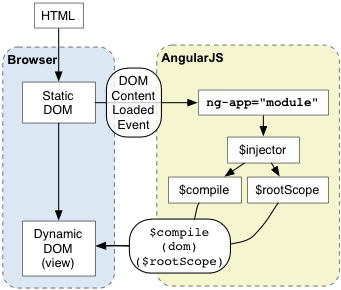
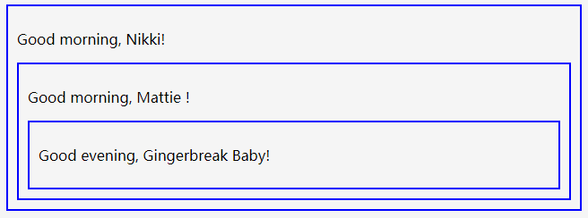

# AngularJS学习笔记

## 绑定

使用双大括号包含的表达式:

```html
<p>
    Nothing here {{'yet' + '!'}}
</p>
```

绑定告诉AngularJS需要运算其中的表达式并将结果插入DOM中，表达式在当前Angular作用域中运行

## 应用

通过ngApp指令引导AngulaJS应用

```html
<!doctype html>
<html lang="en" ng-app>
<head>
	<meta charset="utf-8">
	<title>My HTML File</title>
	<link rel="stylesheet" href="css/app.css">
	<link rel="stylesheet" href="css/bootstrap.css">
	<script src="lib/angular/angular.js"></script>
</head>
<body>
<p>Nothing here {{'yet' + '!'}}</p>
</body>
</html>	
```

用图片描述:


引导过程三个要点:

- 注入器用于创建此应用程序的依赖注入
- 注入器会创建根作用域作为应用程序作用域
- AngularJS会连接根作用域中行的DOM，从用ngApp标记的标签开始逐步处理DOM中的指令和绑定

## 控制器

除了直接使用ngApp指令创建Angular应用，还可以手动创建:

```html
<html ng-app="phonecatApp">
<head>
  ...
  <script src="bower_components/angular/angular.js"></script>
  <script src="js/controllers.js"></script>
</head>
<body ng-controller="PhoneListCtrl">

  <ul>
    <li ng-repeat="phone in phones">
      <span>{{phone.name}}</span>
      <p>{{phone.snippet}}</p>
    </li>
  </ul>

</body>
</html>
```

js代码:

```javascript
var phonecatApp = angular.module('phonecatApp', []);

phonecatApp.controller('PhoneListCtrl', function ($scope) {
  $scope.phones = [
    {'name': 'Nexus S',
     'snippet': 'Fast just got faster with Nexus S.'},
    {'name': 'Motorola XOOM? with Wi-Fi',
     'snippet': 'The Next, Next Generation tablet.'},
    {'name': 'MOTOROLA XOOM?',
     'snippet': 'The Next, Next Generation tablet.'}
  ];
});
```

过程如下:

- 首先通过angular.module('phonecatApp',  [])函数创建phonecatApp对象
- 通过phonecarApp对象的controller方法注册PhoneListCtrl对象
- 最后在html中通过ngApp和ngController分别连接到phonecatApp和PhoneListCtrl

其中需要注意两点:

- 注册PhoneListCtrl的时候，$scope代表该控制器作用域，在标有ngController标签内部所有绑定位置上可以访问到
- ngRepeat指令表示为phones数组中的每个元素创建标签li,其中phones数组在PhoneListCtrl中定义

图片描述:


## 过滤器

使用过滤器处理ngRepeat指令的输入:

```html
<div class="container-fluid">
    <div class="row">
      <div class="col-md-2">
        <!--Sidebar content-->
 
        Search: <input ng-model="query">
 
      </div>
      <div class="col-md-10">
        <!--Body content-->
 
        <ul class="phones">
          <li ng-repeat="phone in phones | filter:query">
            {{phone.name}}
            <p>{{phone.snippet}}</p>
          </li>
        </ul>
 
      </div>
    </div>
  </div>
```

注意两点:

- 使用ngModel指令将input标签的value和query变量进行双向绑定
- 在ngRepeat指令中使用前面绑定的query变量作为过滤器

现在输入框的内容发生变化时会引起query变换，最后导致ngRepeat指令重新执行

## 排序

ngRepeat指令除了接受过滤器以外还支持排序:

```html
Search: <input ng-model="query">
  Sort by:
  <select ng-model="orderProp">
    <option value="name">Alphabetical</option>
    <option value="age">Newest</option>
  </select>
 
  <ul class="phones">
    <li ng-repeat="phone in phones | filter:query | orderBy:orderProp">
      <span>{{phone.name}}</span>
      <p>{{phone.snippet}}</p>
    </li>
  </ul>
```

控制器代码:

```javascript
var phonecatApp = angular.module('phonecatApp', []);
 
phonecatApp.controller('PhoneListCtrl', function ($scope) {
  $scope.phones = [
    {'name': 'Nexus S',
     'snippet': 'Fast just got faster with Nexus S.',
     'age': 1},
    {'name': 'Motorola XOOM? with Wi-Fi',
     'snippet': 'The Next, Next Generation tablet.',
     'age': 2},
    {'name': 'MOTOROLA XOOM?',
     'snippet': 'The Next, Next Generation tablet.',
     'age': 3}
  ];
 
  $scope.orderProp = 'age';
});	
```

要点:

- 添加了select元素，并使用ngModel指令将value和orderProp变量双向绑定
- ngRepeat指令中多加了orderBy过滤器进行排序，作用是对phones数组按照orderProp进行排序
- 在声明PhoneListCtrl的时候给orderProp属性初始值设置为age

## XHR服务

$http是Angular内置的XHR服务,在需要的时候通过依赖注入提供:

```javascript
var phonecatApp = angular.module('phonecatApp', []);
 
phonecatApp.controller('PhoneListCtrl', function ($scope, $http) {
  $http.get('phones/phones.json').success(function(data) {
    $scope.phones = data;
  });
 
  $scope.orderProp = 'age';
});
```

要点:

- 其中$http是由Angular内置的XHR服务,由依赖注入提供

## 图片SRC

在Angular应用中使用img标签,如果src是通过绑定方式给的:

```html

```

那么在Angular计算绑定表达式之前,img标签会将绑定表达式视作url地址发起请求,比如向<http://localhost:8000/app/{{phone.imageUrl}}>发出请求,这当然是不正确的.

可以通过ngSrc指令解决这个问题

```html

```

## 依赖注入

依赖注入是Angular的核心.在启动应用程序的时候,Angular创建了一个注入器,用于寻找并注入你所需要的服务.

### Provider

$provide服务负责告诉Angular如何新建依赖对象,具体有两种方式:

- 通过module对象的config方法:

```javascript
    var myMod = angular.module('myModule', []);

    myMod.config(function($provide) {
        $provide.provider('greeting', function() {
            this.$get = function() {
                return function(name) {
                    alert("Hello, " + name);
                };
            };
        });

        $provide.factory('greeting', function() {
            return function(name) {
                alert("Hello, " + name);
            };
        });

        $provide.service('greeting', function() {
            return function(name) {
                alert("Hello, " + name);
            };
        });

        $provide.value('greeting', function(name) {
            alert("Hello, " + name);
        });
    });
```

- 也可以直接通过module对象调用provider,factory,service,value方法:

```javascript
    var myMod = angular.module('myModule', []);

    myMod.provider('greeting', function() {
        this.$get = function() {
            return function(name) {
                alert("Hello, " + name);
            };
        };
    });

    myMod.factory('greeting', function() {
        return function(name) {
            alert("Hello, " + name);
        };
    });

    myMod.service('greeting', function() {
        return function(name) {
            alert("Hello, " + name);
        };
    });

    myMod.value('greeting', function(name) {
        alert("Hello, " + name);
    });
```

### Injector

注入器调用$provide创建服务实例.每个Angular程序都只有一个注入器,它是在应用启动的时候创建的.可以通过$injector拿到注入器的引用.

- 可以通过调用get方法来获取服务名字对应的实例对象

```javascript
    var greeting = $injector.get('greeting');
    greeting('Ford Prefect');
```

- 也可以显示向任何方法进行注入

```javascript
    var myFunction = function(greeting) {
        greeting('Ford Prefect');
    };
    $injector.invoke(myFunction);
```

注入器只会创建一次服务实例,以后每次通过注入器拿到的实例都和第一次创建的实例是同一个对象

### 配置Providers

Angular程序分为config和run两个阶段.在config阶段,可以安装任何必要的provider,例如directives,controllers,filters.在run阶段,Angular才编译DOM并启动app.

可以通过config和run方法分别向这两个阶段添加代码,在config阶段,只有privoders被注入,而不是他们的实例:

例如,这样是不正确的:

```javascript
myMod.config(function(greeting) {
  // WON'T WORK -- greeting is an *instance* of a service.
  // Only providers for services can be injected in config blocks.
});
```

这样则可以:

```javascript
myMod.config(function(greetingProvider) {
  // a-ok!
});
```

当为service定义了provider后,provider的名字就叫serviceProvider,例如:

```javascript
myMod.provider('greeting', function() {
  var text = 'Hello, ';
      
  this.setText = function(value) {
    text = value;
  };
      
  this.$get = function() {
    return function(name) {
      alert(text + name);
    };
  };
});

myMod.config(function(greetingProvider) {
  greetingProvider.setText("Howdy there, ");
});

myMod.run(function(greeting) {
  greeting('Ford Prefect');
});
```

现在provider上有setText方法,我们可以在config函数中访问provider的此方法.

### Controller

module的controller函数也是一种服务,可以这么理解:

```javascript
myMod.controller('MainController', function($scope) {
  // ...
});
```

等价于:

```javascript
myMod.config(function($controllerProvider) {
  $controllerProvider.register('MainController', function($scope) {
    // ...
  });
});
```

filter和directive也是相似的原理,各自对应着$filterProvider和$compileProvider.

## 路由

Angular框架没有内置路由功能,需要单独安装angular-route包,路由通常和ngView指令搭配使用.

index.html代码:

```html
<!doctype html>
<html lang="en" ng-app="phonecatApp">
<head>
...
  <script src="bower_components/angular/angular.js"></script>
  <script src="bower_components/angular-route/angular-route.js"></script>
  <script src="app.js"></script>
  <script src="controllers.js"></script>
</head>
<body>
 
  <div ng-view></div>
 
</body>
</html>
```

phone-list.html代码:

```html
<div class="container-fluid">
  <div class="row">
    <div class="col-md-2">
      <!--Sidebar content-->
 
      Search: <input ng-model="query">
      Sort by:
      <select ng-model="orderProp">
        <option value="name">Alphabetical</option>
        <option value="age">Newest</option>
      </select>
 
    </div>
    <div class="col-md-10">
      <!--Body content-->
 
      <ul class="phones">
        <li ng-repeat="phone in phones | filter:query | orderBy:orderProp" class="thumbnail">
          <a href="#/phones/{{phone.id}}" class="thumb"></a>
          <a href="#/phones/{{phone.id}}">{{phone.name}}</a>
          <p>{{phone.snippet}}</p>
        </li>
      </ul>
 
    </div>
  </div>
</div>
```

phone-detail.html代码:

```html
detail view for <span>{{phoneId}}</span>
```

app.js代码:

```javascript
var phonecatApp = angular.module('phonecatApp', [
  'ngRoute',
  'phonecatControllers'
]);

phonecatApp.config(['$routeProvider',
  function($routeProvider) {
    $routeProvider.
      when('/phones', {
        templateUrl: 'phone-list.html',
        controller: 'PhoneListCtrl'
      }).
      when('/phones/:phoneId', {
        templateUrl: 'phone-detail.html',
        controller: 'PhoneDetailCtrl'
      }).
      otherwise({
        redirectTo: '/phones'
      });
  }]);
```

要点:

- 使用phonecatApp.config()方法请求$routeProvider,并使用when方法定义路由
- 当url匹配到/phone时,Angular使用phone-list.html和PhoneListCtrl构造视图
- 当url匹配到/phones/:phoneId时,Angular使用phone-detail.html和PhoneDetailCtrl构造试图.其中:phoneId是url变量部分,url中所有用:定义的变量都会被提取出来放到$routeParams对象上

controller.js代码:

```javascript
var phonecatControllers = angular.module('phonecatControllers', []);
 
phonecatControllers.controller('PhoneListCtrl', ['$scope', '$http',
  function ($scope, $http) {
    $http.get('phones/phones.json').success(function(data) {
      $scope.phones = data;
    });
 
    $scope.orderProp = 'age';
  }]);
 
phonecatControllers.controller('PhoneDetailCtrl', ['$scope', '$routeParams',
  function($scope, $routeParams) {
    $scope.phoneId = $routeParams.phoneId;
  }]);
```

### 自定义过滤器

自定义过滤器例子:

```javascript
angular.module('phonecatFilters', []).filter('checkmark', function() {
  return function(input) {
    return input ? '\u2713' : '\u2718';
  };
});
```

使用过滤器:

```html
<dl>
  <dt>Infrared</dt>
  <dd>{{phone.connectivity.infrared | checkmark}}</dd>
  <dt>GPS</dt>
  <dd>{{phone.connectivity.gps | checkmark}}</dd>
</dl>
```

## 事件处理

js代码:

```javascript
var phonecatControllers = angular.module('phonecatControllers',[]);
 
phonecatControllers.controller('PhoneDetailCtrl', ['$scope', '$routeParams', '$http',
  function($scope, $routeParams, $http) {
    $http.get('phones/' + $routeParams.phoneId + '.json').success(function(data) {
      $scope.phone = data;
      $scope.mainImageUrl = data.images[0];
    });
 
    $scope.setImage = function(imageUrl) {
      $scope.mainImageUrl = imageUrl;
    };
  }]);
```

html代码:

```html

```

## Rest服务

angular-resource提供Rest风格借口访问服务,独立于Angular核心包存在.

先创建自定义服务,添加service.js文件:

```javascript
var phonecatServices = angular.module('phonecatServices', ['ngResource']);
 
phonecatServices.factory('Phone', ['$resource',
  function($resource){
    return $resource('phones/:phoneId.json', {}, {
      query: {method:'GET', params:{phoneId:'phones'}, isArray:true}
    });
  }]);
```

使用工厂函数注册自定义服务,并且声明自定义服务依赖$resource.

添加新模块的依赖,修改app.js:

```javascript
...
angular.module('phonecatApp', ['ngRoute', 'phonecatControllers','phonecatFilters', 'phonecatServices']).
...
```

修改controller.js:

```javascript
...
var phonecatControllers = angular.module('phonecatControllers', []);
 
...
 
phonecatControllers.controller('PhoneListCtrl', ['$scope', 'Phone', function($scope, Phone) {
  $scope.phones = Phone.query();
  $scope.orderProp = 'age';
}]);
 
phonecatControllers.controller('PhoneDetailCtrl', ['$scope', '$routeParams', 'Phone', function($scope, $routeParams, Phone) {
  $scope.phone = Phone.get({phoneId: $routeParams.phoneId}, function(phone) {
    $scope.mainImageUrl = phone.images[0];
  });
 
  $scope.setImage = function(imageUrl) {
    $scope.mainImageUrl = imageUrl;
  }
}]);
...
```

要点:

- 使用自定义服务替换掉原来的$http请求

```javascript
    $http.get('phones/phones.json').success(function(data) {
      $scope.phones = data;
    });
```

​	替换成:

```javascript
	$scope.phones = Phone.query();
```

​	这看起来像是一个同步调用,实际上却不是.同步返回的只是一个feature,可以理解为空对象,当XHR相应返回的时候再填入数据

- 有的情况下只使用feature和绑定不足以满足需求,这时候可以使用回调函数来处理,就像PhoneDetailCtrl中所作的那样

## 动画

动画由angular-animate.js提供,独立于Angular核心之外.

**重要**:确保在使用Angular1.4的时候,使用jQuery2.1或以上版本.并确保在所有的AngularJS脚本之前载入jQuery.

### 原理

ngAnimate并不能使HTML元素产生动画,但是它会监听事件,并且给HTML元素设置预定义的class,从而触发css定义的动画.

可以触发添加/移除class的指令:

- ng-show
- ng-hide
- ng-class
- ng-view
- ng-include
- ng-repeat
- ng-if
- ng-switch

ng-show和ng-hide指令用于添加和移除ng-hide class.

其他指令会在进入DOM时添加ng-enter类,移除DOM会添加ng-leave类

当HTML元素位置改变时,ng-repeat也可以添加ng-move类

在动画完成后,HTML元素的类集合将被移除.例如ng-hide指令会添加以下类:

- ng-animate
- ng-hide-animate
- ng-hide-add
- ng-hide-remove
- ng-hide-add-active
- ng-hide-remove-active

### 给ngRepeat添加过度动画

修改phone-list.html代码,给ngRepeat标记的li元素添加class:

```html
<!--
  给li元素添加新的CSS类，之后我们将用它实现动画
-->
<ul class="phones">
  <li ng-repeat="phone in phones | filter:query | orderBy:orderProp"
      class="thumbnail phone-listing">
    <a href="#/phones/{{phone.id}}" class="thumb"></a>
    <a href="#/phones/{{phone.id}}">{{phone.name}}</a>
    <p>{{phone.snippet}}</p>
  </li>
</ul>
```

添加动画css代码animations.css:

```css
.phone-listing.ng-enter,
.phone-listing.ng-leave,
.phone-listing.ng-move {
  -webkit-transition: 0.5s linear all;
  -moz-transition: 0.5s linear all;
  -o-transition: 0.5s linear all;
  transition: 0.5s linear all;
}

.phone-listing.ng-enter,
.phone-listing.ng-move {
  opacity: 0;
  height: 0;
  overflow: hidden;
}

.phone-listing.ng-move.ng-move-active,
.phone-listing.ng-enter.ng-enter-active {
  opacity: 1;
  height: 120px;
}

.phone-listing.ng-leave {
  opacity: 1;
  overflow: hidden;
}

.phone-listing.ng-leave.ng-leave-active {
  opacity: 0;
  height: 0;
  padding-top: 0;
  padding-bottom: 0;
}
```

动画钩子执行顺序:

- 创建元素->.ng-enter->.ng-enter-active->默认状态
- 默认状态->.ng-leave->.ng-leave-active->销毁元素

### 给ngView添加关键帧动画

现在给路由变化切换视图的时候添加关键帧动画.

修改index.html:

```html
<div class="view-container">
  <div ng-view class="view-frame"></div>
</div>
```

要点:

- 给标记ngView的元素包裹一层容器,采用relative定位
- 给标记ngView的元素添加view-frame类

修改animations.css:

```css
.view-container {
  position: relative;
}

.view-frame.ng-enter, .view-frame.ng-leave {
  background: white;
  position: absolute;
  top: 0;
  left: 0;
  right: 0;
}

.view-frame.ng-enter {
  -webkit-animation: 0.5s fade-in;
  -moz-animation: 0.5s fade-in;
  -o-animation: 0.5s fade-in;
  animation: 0.5s fade-in;
  z-index: 100;
}

.view-frame.ng-leave {
  -webkit-animation: 0.5s fade-out;
  -moz-animation: 0.5s fade-out;
  -o-animation: 0.5s fade-out;
  animation: 0.5s fade-out;
  z-index:99;
}

@keyframes fade-in {
  from { opacity: 0; }
  to { opacity: 1; }
}
@-moz-keyframes fade-in {
  from { opacity: 0; }
  to { opacity: 1; }
}
@-webkit-keyframes fade-in {
  from { opacity: 0; }
  to { opacity: 1; }
}

@keyframes fade-out {
  from { opacity: 1; }
  to { opacity: 0; }
}
@-moz-keyframes fade-out {
  from { opacity: 1; }
  to { opacity: 0; }
}
@-webkit-keyframes fade-out {
  from { opacity: 1; }
  to { opacity: 0; }
}
```

使用动画钩子和关键帧动画实现路由变化时视图的渐隐和渐显效果

### 使用JavaScript添加动画

使用JavaScript给phone-detail.html页面中切换缩略图过程添加动画.

修改phone-detail.html:

```html
<!-- We're only changing the top of the file -->
<div class="phone-images">
  
</div>

<h1>{{phone.name}}</h1>

<p>{{phone.description}}</p>

<ul class="phone-thumbs">
  <li ng-repeat="img in phone.images">
    
  </li>
</ul>
```

要点:

- img元素添加phone类
- img元素添加ngClass属性,根据mainImageUrl变量确定是否添加或删除active类
- 第二个img元素上使用ngMouseEnter事件调用setImage函数修改mainImageUrl变量

为了保证在页面第一次加载的时候能够正确显示,需要修改app.css:

```css
.phone-images {
  background-color: white;
  width: 450px;
  height: 450px;
  overflow: hidden;
  position: relative;
  float: left;
}

...

img.phone {
  float: left;
  margin-right: 3em;
  margin-bottom: 2em;
  background-color: white;
  padding: 2em;
  height: 400px;
  width: 400px;
  display: none;
}

img.phone:first-child {
  display: block;
}
```

创建animations.js:

```javascript
var phonecatAnimations = angular.module('phonecatAnimations', ['ngAnimate']);

phonecatAnimations.animation('.phone', function() {

  var animateUp = function(element, className, done) {
    if(className != 'active') {
      return;
    }
    element.css({
      position: 'absolute',
      top: 500,
      left: 0,
      display: 'block'
    });

    jQuery(element).animate({
      top: 0
    }, done);

    return function(cancel) {
      if(cancel) {
        element.stop();
      }
    };
  }

  var animateDown = function(element, className, done) {
    if(className != 'active') {
      return;
    }
    element.css({
      position: 'absolute',
      left: 0,
      top: 0
    });

    jQuery(element).animate({
      top: -500
    }, done);

    return function(cancel) {
      if(cancel) {
        element.stop();
      }
    };
  }

  return {
    addClass: animateUp,
    removeClass: animateDown
  };
});
```

要点:

- 使用animation函数注册phone类动画钩子处理模块
- 模块中需返回addClass和removeClass两个函数,分别用于处理类添加和类删除的情况
- 处理函数中使用了jQuery处理动画
- 处理函数最后可以返回一个函数,当动画取消或完成时会调用次函数,参数表示动画是否被取消,这里可做扫尾工作

## 基本概念

Angular中的主要概念:

- 模板(Template):带有Angular扩展标记的HTML
- 指令(Directive):通过自定义属性和元素扩展HTML行为
- 模型(Model):用于展示给用户并且与用户互动的数据
- 作用域(Scope):用来存储模型(Model)的上下文(context).模型放在这个上下文中才能被控制器,指令和表达式等访问到
- 表达式(Expression):模板中可以通过它来访问作用域(Scope)中的变量和函数
- 编译器(Compiler):用来编译模板(Template),并且对其中包含的指令(Directive)和表达式(Expression)进行实例化
- 过滤器(Filter):负责格式化表达式(Expression)的值
- 视图(View):用户看到的内容
- 数据绑定(Data Binding):自动同步模型(Model)中的数据和视图(View)
- 控制器(Controller):视图(View)背后的业务逻辑
- 依赖注入(Dependency Injection):负责创建和自动装载对象或函数
- 注入器(Injector):用来实现依赖注入的容器
- 模块(Module):用来配置注入器
- 服务(Service):独立于视图的,可复用的业务逻辑

## 自动初始化

Angular会在以下两种情况自动初始化:

- 在DOMContentLoaded事件被触发时
- 在angular.js脚本被执行的同时如果document.readyState被设置为complete(为了兼容老版本IE)

初始化时,Angular会去找ngApp指令,一旦找到ngApp执行会完成以下几件事:

- 加载ngApp执行所指定的模块
- 创建应用所需的injector
- 以ngApp所在的节点为根节点,开始遍历并编译DOM树

代码:

```html
<!doctype html>
<html ng-app="optionalModuleName">
  <body>
    I can add: 3.
    <script src="angular.js"></script>
  </body>
</html>
```

图片描述:



## 手动初始化

如果想在初始化阶段拥有更多的控制权,可以手动启动应用:

```html
<!doctype html>
<html xmlns:ng="http://angularjs.org">
  <body>
    Hello World!
    <script src="http://code.angularjs.org/angular.js"></script>
    <script>
       angular.element(document).ready(function() {
         angular.module('myApp', []);
         angular.bootstrap(document, ['myApp']);
       });
    </script>
  </body>
</html>
```

## 编译器

编译器是Angular提供的一项服务.编译过程分为两个阶段:

- 编译:遍历DOM节点,收集所有的指令,返回一个连接函数(link fun)
- 连接:将上一步收集到的每个指令与其所在的作用域连接生成一个实时视图.任何作用域中的模型改变都会实时在视图中反映出来.同时任何用户与视图的交互则会映射到作用域的模型中.这样作用域中的数据模型就成了唯一的数据源

npRepeat指令会为集合中的每个项目克隆一次DOM元素.但是克隆的模板只需要被编译一次,然后为每个克隆的实例做一次连接,这样分为编译和连接两个阶段就有效提升了性能.

## 指令

在编译过程中,指令所声明的行为会被触发,指令可以被放在元素名,属性,类名,甚至是注释中.

指令可以理解为编译器在遍历DOM时碰到就需要执行的函数.

例如元素可拖拽的指令:

```html
<!doctype html>
<html ng-app="drag">
  <head>
    <script src="http://code.angularjs.org/1.2.25/angular.min.js"></script>
    <script src="script.js"></script>
  </head>
  <body>
    <span draggable>Drag ME</span>
  </body>
</html>
```

js代码:

```javascript
angular.module('drag', []).
  directive('draggable', function($document) {
    return function(scope, element, attr) {
      var startX = 0, startY = 0, x = 0, y = 0;
      element.css({
       position: 'relative',
       border: '1px solid red',
       backgroundColor: 'lightgrey',
       cursor: 'pointer'
      });
      element.on('mousedown', function(event) {
        // 阻止默认的选中内容的拖拽
        event.preventDefault();
        startX = event.screenX - x;
        startY = event.screenY - y;
        $document.on('mousemove', mousemove);
        $document.on('mouseup', mouseup);
      });
 
      function mousemove(event) {
        y = event.screenY - startY;
        x = event.screenX - startX;
        element.css({
          top: y + 'px',
          left:  x + 'px'
        });
      }
 
      function mouseup() {
        $document.unbind('mousemove', mousemove);
        $document.unbind('mouseup', mouseup);
      }
    }
  });
```

## 作用域继承

展示作用域继承的例子

html代码:

```html
<!doctype html>
<html ng-app="scopeInheritance">
  <head>
    <script src="http://code.angularjs.org/1.2.25/angular.min.js"></script>
    <script src="script.js"></script>
  </head>
  <body>
    <div ng-app="scopeInheritance" class="spicy">
      <div ng-controller="MainCtrl">
        <p>Good {{timeOfDay}}, {{name}}!</p>
    
        <div ng-controller="ChildCtrl">
          <p>Good {{timeOfDay}}, {{name}} !</p>
    
          <div ng-controller="GrandChildCtrl">
            <p>Good {{timeOfDay}}, {{name}}!</p>
          </div>
        </div>
      </div>
    </div>
  </body>
</html>
```

js代码:

```javascript
var myApp = angular.module('scopeInheritance', []);
myApp.controller('MainCtrl', ['$scope', function($scope){
  $scope.timeOfDay = 'morning';
  $scope.name = 'Nikki';
}]);
myApp.controller('ChildCtrl', ['$scope', function($scope){
  $scope.name = 'Mattie';
}]);
myApp.controller('GrandChildCtrl', ['$scope', function($scope){
  $scope.timeOfDay = 'evening';
  $scope.name = 'Gingerbreak Baby';
}]);
```

效果:



要点:

- 上面例子中每个controller管理着一个scope,再加上root scope一共有4个作用域
- MainCtrl的scope拥有timeOfDay和那么两个属性
- ChildCtrl的scope继承了MainCtrl scope的timeOfDay属性,但重写了name属性
- GradChildCtrl的scope重写了MainCtrl scope的timeOfDay和ChildCtrl scope中的name属性
- 方法继承和属性继承是相同的方式

## 控制器单元测试

控制器定义:

```javascript
var myApp = angular.module('myApp',[]);

myApp.controller('MyController', function($scope) {
    $scope.spices = [{"name":"pasilla", "spiciness":"mild"},
                     {"name":"jalapeno", "spiceiness":"hot hot hot!"},
                     {"name":"habanero", "spiceness":"LAVA HOT!!"}];
    $scope.spice = "habanero";
});
```

控制器测试:

```javascript
describe('myController function', function() {
 
  describe('myController', function() {
    var $scope;
 
    beforeEach(module('myApp'));
 
    beforeEach(inject(function($rootScope, $controller) {
      $scope = $rootScope.$new();
      $controller('MyController', {$scope: $scope});
    }));
 
    it('should create "spices" model with 3 spices', function() {
      expect($scope.spices.length).toBe(3);
    });
 
    it('should set the default value of spice', function() {
      expect($scope.spice).toBe('habanero');
    });
  });
});
```

如果需要测试嵌套关系的控制器,那么在测试代码中也需要创建对应的scope层级结构:

```javascript
describe('state', function() {
    var mainScope, childScope, grandChildScope;
 
    beforeEach(module('myApp'));
 
    beforeEach(inject(function($rootScope, $controller) {
        mainScope = $rootScope.$new();
        $controller('MainCtrl', {$scope: mainScope});
        childScope = mainScope.$new();
        $controller('ChildCtrl', {$scope: childScope});
        grandChildScope = childScope.$new();
        $controller('GrandChildCtrl', {$scope: grandChildScope});
    }));
 
    it('should have over and selected', function() {
        expect(mainScope.timeOfDay).toBe('morning');
        expect(mainScope.name).toBe('Nikki');
        expect(childScope.timeOfDay).toBe('morning');
        expect(childScope.name).toBe('Mattie');
        expect(grandChildScope.timeOfDay).toBe('evening');
        expect(grandChildScope.name).toBe('Gingerbreak Baby');
    });
});
```

